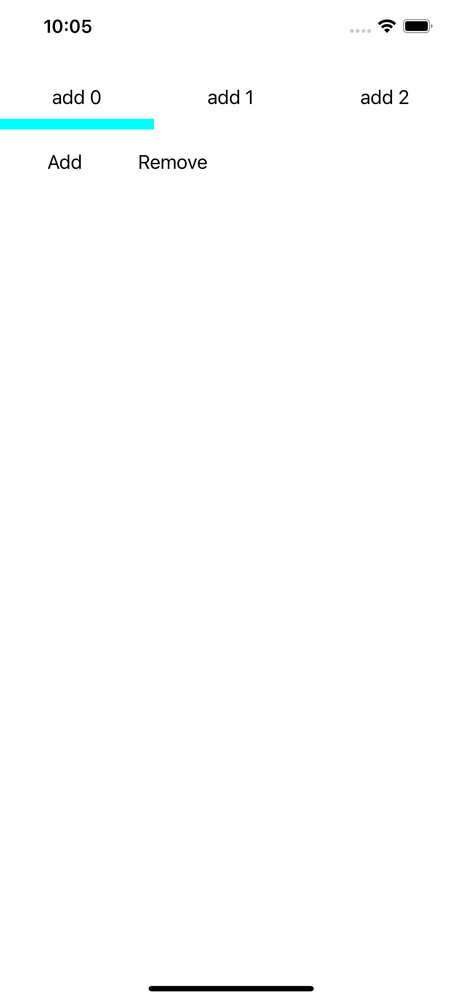

# Description
 
 カーソルをつけたタブ型セレクションボタンが欲しかったので、つくってみました。
 上下左右にカーソルを設定できます。
 他にもカラー設定の自由度を上げてみましたので、他にもカスタマイズしたい箇所があればリクエストください。

 
# DEMO

 
 
# Requirement
 
* Swift5
* Xcode 13.4
 
# Install for your Project.

## CocoaPods

add your podfile
 
# Author
 
* rayRyou
* Freelance Programmer
 
# License
 
TabSelectionButton is under [MIT license](https://en.wikipedia.org/wiki/MIT_License).
